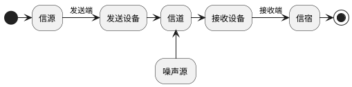

## 1. 通信的基本概念
### 1.1 消息、信息和信号
1. **消息**: 对事物的物理状态变化的描述　(如：温度、语音、文字、图像)
2. **信息**: 消息中有用的内容
3. **信号**: 为传递消息使用的方式

<!--more-->

### 1.2 通信
* 由一地向另一地传递消息(信息)

## 2 通信模型

* **信源**: 消息的产生地
* **发送设备**: 将原始电信号转换为适于在信道中传输的信号(变换、编码、调制)
* **信道**: 传输媒介或途径
* **噪声源**: 散布在系统各部分的噪声集中表现，噪声降低通信质量 
* **接受设备**: 将信号转换为原始信号(调解、译码)
* **信宿**: 信息的归宿点，将电信号转换为相应消息

