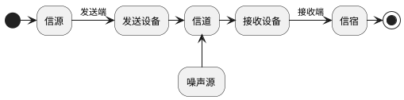

# 第一章 绪论

## 1. 基本概念
### 1.1 消息、信息和信号
1. **消息**: 对事物的物理状态变化的描述　(如：温度、语音、文字、图像)
2. **信息**: 消息中有用的内容
3. **信号**: 为传递消息使用的方式

### 1.2 通信
* 由一地向另一地传递消息(信息)

   <!--more -->

### 2. 通信模型

* **信源**: 消息的产生地
* **发送设备**: 将原始电信号转换为适于在信道中传输的信号(变换、编码、调制)
* **信道**: 传输媒介或途径
* **噪声源**: 散布在系统各部分的噪声集中表现，噪声降低通信质量 
* **接受设备**: 将信号转换为原始信号(调解、译码)
* **信宿**: 信息的归宿点，将电信号转换为相应消息

## 2. 信息的度量
### 1. 信息量
$$ 信息量: I = log_a{\frac{1}{P(x)}} = -log_a{P(x)}$$
* **一般以2为底** $I = log_2{\frac{1}{P(x)}}$ 单位为 bit(比特)
* 以e为底 单位是奈特

### 2. 平均信息量
* 由M个符号组成的消息, 每个符号所含的平均信息量为:
$$H(X) = - \sum_{i=1}^M{P(x)log_2{P(x_i)}} \space (bit/符号)$$ 

## 3. 性能指标

### 3.1 可靠性和有效性

* **数字通讯**
    1. 有效性: 传输速率
    2. 可靠性: 误码率
* **模拟通讯**
    1. 有效性: 有效传输频带(有效带宽)
    2. 可靠性: 传输信噪比

### 3.2 数字通讯传输速率、频带利用率
1. **码元传输速率:**
    $$R_s=\frac{1}{T_s}(Baud)$$
    1. 单位波特(Baud)
    2. $R_s$: 码元传输速率
    3. $T_s$: 码间间隔

2. **信息传输速率(传信率)**
    1. 单位: 比特/秒、bit/s 、b/s　、bps
    2. 对于M进制,的等概率数字系统 $R_b=R_s \times log_2M (bit/s)$
    3. 若出现的概率不同$R_b=R_s \times H(X) (bit/s)$
3. **频带利用率 $\eta$**
    1. 传输速率\(R\)和频带宽度(B)之比,即单位频带内的传播速率
        * $\eta = \frac{R_s}{B} 或 \eta = \frac{R_b}{B} $
        * B 为所需带宽

### 3.3 差错率
1. **误码率** 
    * $P_e = \frac{错误接受的码元数}{传输总的码元数}$
2. **误信率** 
    * $P_b = \frac{错误接受的比特数}{接受的总比特数}$
3. 关系
    * 对于二进制 $P_e = P_b$
    * 对于M进制 $P_e \geq P_b$

# 第二章 信道

