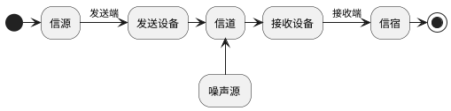
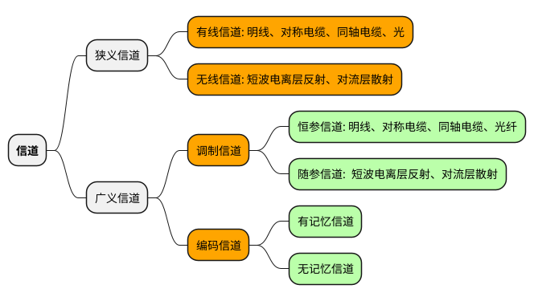

## 第一章 绪论

### 1. 基本概念
#### 1.1 消息、信息和信号
1. **消息**: 对事物的物理状态变化的描述　(如：温度、语音、文字、图像)
2. **信息**: 消息中有用的内容
3. **信号**: 为传递消息使用的方式

#### 1.2 通信
* 由一地向另一地传递消息(信息)

#### 1.3 通信模型

* **信源**: 消息的产生地
* **发送设备**: 将原始电信号转换为适于在信道中传输的信号(变换、编码、调制)
* **信道**: 传输媒介或途径
* **噪声源**: 散布在系统各部分的噪声集中表现，噪声降低通信质量 
* **接受设备**: 将信号转换为原始信号(调解、译码)
* **信宿**: 信息的归宿点，将电信号转换为相应消息

### 2. 信息的度量
#### 1. 信息量
$$ 信息量: I = log_a{\frac{1}{P(x)}} = -log_a{P(x)}$$
* **一般以2为底** $I = log_2{\frac{1}{P(x)}}$ 单位为 bit(比特)
* 以e为底 单位是奈特

#### 2. 平均信息量
* 由M个符号组成的消息, 每个符号所含的平均信息量为:
$$H(X) = - \sum_{i=1}^M{P(x)log_2{P(x_i)}} \space (bit/符号)$$ 
* 最大熵条件为各符号独立等概
$$H(X) = log_2M$$

### 3. 性能指标

#### 3.1 可靠性和有效性

* **数字通讯**
    1. 有效性: 传输速率
    2. 可靠性: 误码率
* **模拟通讯**
    1. 有效性: 有效传输频带(有效带宽)
    2. 可靠性: 传输信噪比

#### 3.2 数字通讯传输速率、频带利用率
1. **码元传输速率:**
    $$R_s=\frac{1}{T_s}(Baud)$$
    1. 单位波特(Baud)
    2. $R_s$: 码元传输速率
    3. $T_s$: 码间间隔

2. **信息传输速率(传信率)**
    1. 单位: 比特/秒、bit/s 、b/s　、bps
    2. 对于M进制,的等概率数字系统 $R_b=R_s \times log_2M (bit/s)$
    3. 若出现的概率不同$R_b=R_s \times H(X) (bit/s)$
3. **频带利用率 $\eta$**
    1. 传输速率\(R\)和频带宽度(B)之比,即单位频带内的传播速率
        * $\eta = \frac{R_s}{B} 或 \eta = \frac{R_b}{B} $
        * B 为所需带宽

#### 3.3 差错率
1. **误码率** 
    * $P_e = \frac{错误接受的码元数}{传输总的码元数}$
2. **误信率** 
    * $P_b = \frac{错误接受的比特数}{接受的总比特数}$
3. 关系
    * 对于二进制 $P_e = P_b$
    * 对于M进制 $P_e \geq P_b$

## 第二章 信道
### 1. 分类
1. 狭义信道: 传输信号的媒介
2. 广义信道: 扩大了范围的信道

### 2. 信道模型
#### 2.1 调制信道模型
* **二对端信道模型**
    * $e_0{t}=f{e_i(t)}+n(t)$
* $f(e(t))$ 为信道对信号影响的某种函数关系,可设想成与干扰相乘的形式,因此可写成**下面式子**
    * $e_0(t) = k(t) \cdot e_i{t}+n(t)$
    * 恒参信道: $k(t)$不随时间变化，或变化很慢
    * 随参信道: $k(t)$随时间变化

### 3. 恒参信道
#### 3.1恒参信道一般特性
1. 幅度－频率特性(简称幅频特性)  和  相位－频率特性(简称相频特性)
    * $$H(\omega) = |H(\omega)|e^{j\phi(\omega)}$$
    * $|H(\omega)|$为**幅频**特性
    * $\phi(\omega)$为**相频**特性
2. 恒参信道对信号传输的影响是:
    1. 对信号在**幅度**上产生固定的**衰减**
    2. 对信号在**时间**上产生了固定的**迟延**J
    * 以上两条满足了信号无失真传输的条件

### 4. 随参信道
1. 特点
    1. 信号衰耗随时间**随机**变化
    2. 信号传输的时延随时间**随机**变化
    3. 多径传播

### 5. 连续信道容量
1. 信道容量公式(**香农公式**)
    * $$C = Blog_2{1+\frac{S}{N}} \space (bit/s)$$ 
    * B(Hz) 为带宽
    * S(W) 为功率
    * N(W) 为加性高斯噪声
2. 信噪比: $dB = 10 \times log_{10}(S/N)$

2. 结论
    1. 增大功率、减少噪声都可以增加,都可以让信道容量趋于无穷大
    2. 增大信道带宽不能让信道**不能**让信道容量趋于无穷大

## 第三章 模拟调制系统
### 1. 模拟调制的概念
1. 模拟调制的功能
    1. 适合信道传输
    2. 实现有效辐射
    3. 实现频率分配
    4. 实现多路复用
    5. 提高系统抗噪声性能

2. 分类
    1. 按调制信号$(m(t))$不同: 模拟调制和数字调制
    2. 按载波$(c(t))$不同: 连续波调制、脉冲波调制
    3. 按所调载波的参数不同
        * 幅度调制
        * 频率调制
        * 相位调制
    4. 调制器$H(\omega)$
        * **线性调制**: 振幅(AM)、双边带(DSB)、单边带(SSB)、残留边带(VSB)
        * **非线性调制**: FM，PM

### 2. 振幅调制(AM)
#### 2.1 AM时域表达式
* $$S_{AM} = [A_0+m(t)]\cos\omega_ct$$
* $A_0$ 为外加直流分量
* $m(t)$为输入调制信号,无直流分量,最高频为$f_m$(**原始信号**)
* $\omega_c$为载波的频率,必须有$|m(t)|_{max} \leq A_0$

#### 2.2 AM频域表达式
* **结论**
    1. 调制后频谱形状没有变化，仅仅是信号频谱位置发生了变化
    2. AM信号由 $\pm\omega_c$ 处的冲激函数 和 $\pm\omega_c$两边的边带频谱组成
    3. 调制前基带信号的频带宽度为$f_m$ , 调制之后为$2f_m$
* 边带: 阴影部分为上边带(USB), 其余为下边带(LSB)
     

#### 2.3 平均功率
* $$P_{AM} = \frac{A_0}{2}+\frac{\overline{m^2(t)}}{2} = P_c + P_s$$
* 其中:
    * $P_c =\frac{A_0}{2}$ 为载波功率
    * $P_s =\frac{\overline{m^2(t)}}{2}$为边带功率
    * 只有边带功率与信号有关，载波分量不携带信息

#### 2.4 AM信号调制效率
* 通常把边带功率$P_s$ 与信号总功率$P_AM$的比值称为调制效率,用符号$\eta_{AM}$表示
$$\eta_{AM} = \frac{P_s}{P_{AM}} = \frac{\overline{m^2(t)}}{A_0^2+\overline{m^2(t)}}$$

#### 2.5 AM解调
1. 相干解调
2. 非相干解调

### 3. 抑制载波双边带(DSB)
#### 3.1 DSB 的时域表达式
* $$S_{DSB} = m(t)\cos(\omega_ct)$$

#### 3.2 DSB平均功率:
* $$P_{DSB}=\frac{1}{2}\overline{m^2(t)}=P_s$$

#### 3.3 DSB调制效率:
* $$\eta_{DSB} = \frac{P_s}{P_{DSB}}=100\%$$

#### 3.4 DSB解调
* 只能相干解调

#### 3.5 频带宽度
* $B_{DSB}=2f_m$

#### 3.6 其他
* 公式: $2\cos\alpha\cos\beta =\cos(\alpha-\beta)+\cos(\alpha+\beta)$
* USB 上边带: $\cos(\alpha+\beta)$
* LSB 下边带: $\cos(\alpha-\beta)$

### 4. 单边带调制(SSB)
#### 4.1 SSB 的时域表达式
* $$S_{SSB}(t) = \frac{A}{2}\cos(\omega_c \pm \omega_m)t$$
#### 4.2 频带宽度
* $B_{DSB}=2f_m$

#### 4.3 平均功率
* $$P_{SSB} = \frac{1}{2} P_{DSB} = \frac{1}{4} \overline{m^2(t)}$$

### 5. 残留边带(VSB)
* **发送功率和频带宽度**(都介于单边带和双边带之间)
    * $P_{SSB} \leq P_{VSB} \leq P_{DSB}$ 
    * $B_{SSB} \leq B_{VSB} \leq B_{DSB}$ 

### 6. 线性调制系统抗噪声性能
* 输出信噪比,定义:
* $$\frac{s_i}{n_i}=\frac{解调器输入已调信号平均功率}{解调器输入噪声平均功率}=\frac{\overline{s_m^2(t)}}{\overline{n_i^2(t)}}$$
#### 6.1 DSB 调制系统性能
1. **输入信噪比**
    * $$\frac{S_i}{N_i}= \frac{\overline{m^2(t)}}{2N_0B_{DSB}}$$
2. **输出信噪比**
    * $$\frac{S_0}{N_0}= \frac{\overline{m^2(t)}}{N_0B_{DSB}}$$
3. **制度增益**
    * $$G_{DSB} =\frac{S_0 / N_0}{S_i / N_i} = 2$$

#### 6.2 AM 调制系统性能
1. **输入信噪比**
    * $$\frac{S_i}{N_i}= \frac{A_0^2\overline{m^2(t)}}{2N_0B_{DSB}}$$
2. **输出信噪比**
    * $$\frac{S_0}{N_0}= \frac{\overline{m^2(t)}}{N_0B_{DSB}}$$
3. **制度增益**
    * $$G_{DSB} =\frac{S_0 / N_0}{S_i / N_i} =\frac{2\overline{m^2(t)}}{A_0^2+m^2(t)} = 2$$
    * $G_AM$ 最大为 $\frac{2}{3}$

#### 6.3 SSB 调制系统性能
1. **输入信噪比**
    * $$\frac{S_0}{N_0}= \frac{\overline{m^2(t)}}{4N_0B_{DSB}}$$
2. **输出信噪比**
    * $$\frac{S_0}{N_0}= \frac{\overline{m^2(t)}}{4N_0B_{DSB}}$$
3. **调制制度增益**
    * $$G_{DSB} =\frac{S_0 / N_0}{S_i / N_i} = 1$$

## 第四章 模拟信号数字化传输
### 1. 采样定理(抽样定理):
#### 1.1 低通抽样定理
1.  频带限制在$(0,f_H)$ 内的时间连续信号$m(t)$, 如果抽样频率$f_s$ 大于或等于$2f_H$,则可以由抽样值序列$m_s(t)$ 无失真重建$m(t)$
2. 奈奎间隔: 最大允许抽样间隔$T \leq \frac{1}{2f_H}$
3. 奈奎斯特速率: 最低抽样速率$f_s = 2f_H$

#### 1.2 带通抽样定理
1. 一个带通信号m(t), 其频率限制在$f_L$与$f_H$之间,带宽$B=f_H-f_L$,则最小抽样速率$f_s=\frac{2f_H}{m}$ 其中m是一个不超过$\frac{f_H}{B}$的最大整数
2. 若最高频率$f_H$ 为带宽的整数倍,即$f_H=nB$,最小抽样频率为$f_s= 2B$
3. 若最高频率$f_H$不为带宽的整数倍,即
    * 因为 $f_H= nB + kB, \space n<k<1$, m 为小于(1+k)的最大整数， m =n
    * 最小抽样速率: $f_s = 2B(1+ \frac{k}{n})$

### 2. 脉冲振幅调制(PAM)
* 用周期窄的脉冲信号近似代替冲击脉冲信号
    * 自然抽样
    * 平顶抽样

### 3. 量化
#### 3.1 均匀量化
* 若输入信号最大最小值分别为a,b,量化电平数为M,那么量化间隔为:
    * $$\Delta_i = \Delta=\frac{b-a}{a}$$
#### 3.2 非均匀量化
1. A 压缩率
$$
y=
\begin{cases}
\frac{Ax}{1+lnA} & 0  \leq x \leq \frac{1}{A} \\\\\\
\frac{1+lnAx}{1+lnA} & \frac{1}{A}  \leq x \leq  1
\end{cases}
$$

2. $\mu$ 压缩率
$$y=\frac{ln(1+\mu x)}{ln(1+\mu)}, \space 0  \leq x \leq 1 $$

3. 13 折线
    * 13折线 非常逼近A=87.6 的对数压缩特性
4. 15 折线
    * 逼近 $\mu$率压缩($\mu = 255$)

### 4. 脉冲编码调制 

