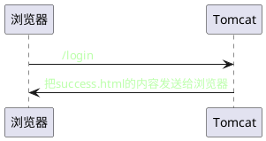
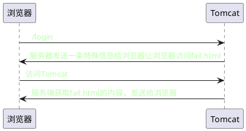

## 1. Servlet

### 1.1 基本流程

```plantuml
 (*)-> "login.html"
-right-> "form表单处理给 '/login' "
-down-> "web.xml映射,给LoginServlet处理"
-right-> "LoginServlet处理"
-right-> "实例化Servelt"
-up-> "重写 doGet,doPost等方法,获取参数，设置响应"
-up-> "返回html"
```


<!--  -->


#### web.xml
```xml
    <!--注册servlet name-->
    <servlet>
        <servlet-name>HelloServlet</servlet-name>
        <!--类的位置-->
        <servlet-class>HelloServlet</servlet-class>
    </servlet>

    <!--设置/hello 映射给HelloServlet-->
    <servlet-mapping>
        <servlet-name>HelloServlet</servlet-name>
        <url-pattern>/hello</url-pattern>
    </servlet-mapping>
```
* 主要实现了处理映射(servlet-mapping标签) 和注册Servlet(servlet标签)

#### loginServlet
```java
 @Override
    protected void service(HttpServletRequest request, HttpServletResponse response) throws IOException, ServletException {

        System.out.println("3. ========== service ============= 函数");

        /**
         * 中文乱码，设置编码
         */
        request.setCharacterEncoding("UTF-8"); //request(请求) 编码
        response.setContentType("text/html;charset=UTF-8"); //response(响应) 编码

        String name = request.getParameter("name");
        String password = request.getParameter("password");

        if (name.equals("admin") && password.equals("admin")) { //密码正确
            /**
             * 服务器内跳转
             */
            request.getRequestDispatcher("success.html").forward(request, response);
        } else { //密码错误
            /**
             * 客户端中跳转
             */
            response.sendRedirect("fail.html");
        }
    }
```

* service将请求类型分发给doPost, doGet 等方法，用户只用重写这些方法

```java
    /**
    *Servlet 的 service 源码
    */
    protected void service(HttpServletRequest req, HttpServletResponse resp)
        throws ServletException, IOException {

        String method = req.getMethod();

        if (method.equals(METHOD_GET)) {
            long lastModified = getLastModified(req);
            if (lastModified == -1) {
                // servlet doesn't support if-modified-since, no reason
                // to go through further expensive logic
                doGet(req, resp);
            } else {
                long ifModifiedSince;
                try {
                    ifModifiedSince = req.getDateHeader(HEADER_IFMODSINCE);
                } catch (IllegalArgumentException iae) {
                    // Invalid date header - proceed as if none was set
                    ifModifiedSince = -1;
                }
                if (ifModifiedSince < (lastModified / 1000 * 1000)) {
                    // If the servlet mod time is later, call doGet()
                    // Round down to the nearest second for a proper compare
                    // A ifModifiedSince of -1 will always be less
                    maybeSetLastModified(resp, lastModified);
                    doGet(req, resp);
                } else {
                    resp.setStatus(HttpServletResponse.SC_NOT_MODIFIED);
                }
            }

        } else if (method.equals(METHOD_HEAD)) {
            long lastModified = getLastModified(req);
            maybeSetLastModified(resp, lastModified);
            doHead(req, resp);

        } else if (method.equals(METHOD_POST)) {
            doPost(req, resp);

        } else if (method.equals(METHOD_PUT)) {
            doPut(req, resp);

        } else if (method.equals(METHOD_DELETE)) {
            doDelete(req, resp);

        } else if (method.equals(METHOD_OPTIONS)) {
            doOptions(req,resp);

        } else if (method.equals(METHOD_TRACE)) {
            doTrace(req,resp);

        } else {
            //
            // Note that this means NO servlet supports whatever
            // method was requested, anywhere on this server.
            //

            String errMsg = lStrings.getString("http.method_not_implemented");
            Object[] errArgs = new Object[1];
            errArgs[0] = method;
            errMsg = MessageFormat.format(errMsg, errArgs);

            resp.sendError(HttpServletResponse.SC_NOT_IMPLEMENTED, errMsg);
        }
    }
```

#### servlet 跳转
1. 服务端跳转
```java
request.getRequestDispatcher("success.html").forward(request, response);
```
* 流程如下


2. 客户端跳转
```java
response.sendRedirect("fail.html");
```
* 流程如下



### 1.2 生命周期
#### a. 实例化

#### b. 初始化
#### c. 提供服务
#### d. 销毁
#### e. 被回收