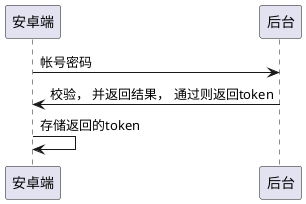
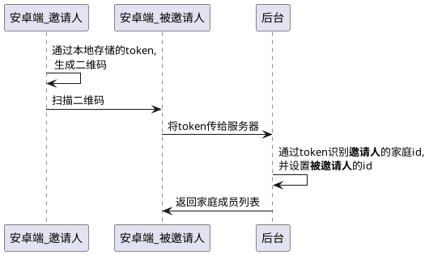
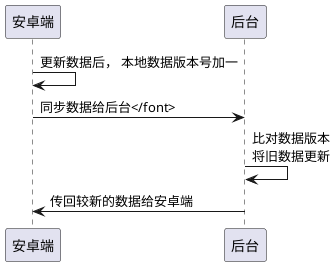

## 一. 简介
> 本项目为了解决家庭成员在生活中帐目信息不能同步，家庭备忘录不同步的问题,并且有一定的互动功能
* 项目 [gitee地址](https://gitee.com/voghost/family_share_andorid)
* 项目 [文档介绍](https://blog.ghovos.com/2021/05/19/andorid-family-share/)
* 应用下载 [链接](https://android-share.ghovos.top/download/)
### 1.1. `HomeHelper` 家庭帮手 特点
* :chart_with_upwards_trend:家庭记账,和分析近期情况,并且能家庭同步 
* :golf:同步分享动态
* :ledger:同步家庭备忘录
* :closed_lock_with_key: 二维码分享加入家庭，且token校验 

### 1.2. 界面展示
1. 主界面

2. 个人中心


### 1.3. 使用的技术栈
* `Android jetpack`
* `Room` 数据库的ORM框架
* `LiveData` 动态刷新页面
* `ViewModel` 保存页面数据，用其维护数据
* `kotlinx.coroutines` **协程**， io操作在协程中运行, 防止阻塞ui线程
* `retrofit2` 和 `OkHttp2` 和后台发送网络请求
* 后台使用 `spring boot` `spring security` 开发的api, 以及安全验证功能

## 二. 主要功能介绍
### 2.1. 添加帐单并同步
* 记账
* 同步家庭帐单
* 通过折线图统计近期家庭帐单信息
### 2.2. 扫描二维码加入家庭
* 二维码分享
* 扫描二维码加入家庭
### 2.3. 备忘录添加并同步
* 同步备忘录， 
* 家庭成员都能看到备忘录
### 2.4. 分享功能
* 分享近期的动态(表情，图片，回复)

## 三. 主要功能逻辑实现
### 3.1. 登陆功能 `api-android.ghovos.top/user/login`


### 3.2. 注册功能 `api-android.ghovos.top/user/regist`
* 大致流程与登陆相同， 但是要判断用户名**是否重复**

### 3.3. 二维码分享加入家庭 `api-android.ghovos.top/user/join_family`


### 3.4. 同步功能（以帐单为例）`api-android.ghovos.top/user/syn_family`


### 3.5. 头像上传功能
* 本地读取图片， 通过api上传端后台
* 后台将图片存入oss, 加速图片访问

## 四. 页面部分
### 4.1 RecycleView 和 LiveData配合使用
```xml
<!-- example -->
<androidx.recyclerview.widget.RecyclerView
            <!-- 一些属性 -->
            tools:listitem="@layout/memorandum_item" />
```
* 通过自定义adapter ,设置view的数据， 以及 因为有livedata,数据可以实时自动刷新
```kotlin
   viewModel.getLiveData()
            ?.observe(viewLifecycleOwner, { memorandumList: List<Memorandum> ->
                memorandum_recycle_view.adapter =
                    MemorandumAdapter(
                        ctx,
                        memorandumList,
                        viewModel,
                    )
                memorandum_recycle_view.layoutManager = LinearLayoutManager(activity)
            })
```

### 4.2 Fragment 
* 在MainActivity中使用Fragment
* 多个页面在Activity中嵌套切换
```kotlin
 //底部导航栏绑定
bottomNavigationView = findViewById(R.id.bottomNavigationView)
navHostFragment = supportFragmentManager.findFragmentById(R.id.fragment) as NavHostFragment
navController = navHostFragment.navController
configuration = AppBarConfiguration.Builder(bottomNavigationView.menu).build()
NavigationUI.setupActionBarWithNavController(this, navController, configuration)
NavigationUI.setupWithNavController(bottomNavigationView, navController)
```

## 五. 功能主要代码实现
### 5.1. 网络部分
1. 添加网络权限
```xml
    <uses-permission android:name="android.permission.INTERNET" />
```
2. 使用retrofit 封装不同的请求
```kotlin
/**
* example
*/
@POST("account/syn")
suspend fun syn(@Body accountList: List<AccountTdo>): BaseResponse<List<AccountTdo>>
```

3. 创建retrofit对象
```kotlin
/**
* example
* 通过 retrofit 网络发送请求
*/
object UserApi {
    private val gsonFormat = GsonBuilder().setDateFormat("yyyy-MM-dd HH:mm:ss").create()

    private val api by lazy {
        val retrofit = Retrofit.Builder()
            .addConverterFactory(GsonConverterFactory.create(gsonFormat))
            .client(
                OkHttpClient
                    .Builder()
                    .addInterceptor(MyIntercept())
                    .build()
            )
            .build()
        retrofit.create(UserService::class.java)
    }

    fun get(): UserService {
        return api
    }
}
```

4. retrofit异常处理
```kotlin
suspend inline fun <T> apiCall(crossinline call: suspend CoroutineScope.() -> BaseResponse<T>): BaseResponse<T> {
    return withContext(Dispatchers.IO) {
        val res: BaseResponse<T>
        try {
            res = call()
        } catch (e: Throwable) {
            Log.e("ApiCaller", "request error", e)
            // 请求出错，将状态码和消息封装为 ResponseResult
            return@withContext ApiException.build(e).toResponse<T>()
        }
        if (res.code == ApiException.CODE_AUTH_INVALID) {
            Log.e("ApiCaller", "request auth invalid")
            // 登录过期，取消协程，跳转登录界面
            // 省略部分代码
            cancel()
        }
        return@withContext res
    }
}

// 网络、数据解析错误处理
class ApiException(
    private val code: Int,
    override val message: String?,
    override val cause: Throwable? = null
) : RuntimeException(message, cause) {
    companion object {
        // 网络状态码
        const val CODE_NET_ERROR = 4000
        const val CODE_TIMEOUT = 4080
        const val CODE_JSON_PARSE_ERROR = 4010
        const val CODE_SERVER_ERROR = 5000

        // 业务状态码
        const val CODE_AUTH_INVALID = 401

        fun build(e: Throwable): ApiException {
          /**
           *  各种异常 不同处理
           */
        }
    }

    fun <T> toResponse(): BaseResponse<T> {
        return BaseResponse(code, message)
    }
}
```

5. 后端和安卓端之间传递数据用json


### 5.2. 数据库部分
1. 创建实体 `Account` `User` `Memorandum`
2. 编写数据库查询语句 dao
```kotlin
    /**
     * 获取所有数据的列表
     * @return LiveData  实时数据 不用在新的线程执行
     */
    @Query("SELECT * FROM account_table WHERE isDeleted=0")
    fun getAll(): LiveData<List<Account>>
```
3. 用单例模式创建数据库
```kotlin
    /**
     * 单例模式
     */
    companion object {
        @Volatile
        private var INSTANCE: FamilyShareDatabase? = null
        private val applicationScope = CoroutineScope(SupervisorJob())


        fun getInstance(context: Context): FamilyShareDatabase = INSTANCE ?: synchronized(this) {
            INSTANCE ?: buildDatabase(context).also { INSTANCE = it }
        }

        private fun buildDatabase(context: Context) =
            Room.databaseBuilder(
                context.applicationContext,
                FamilyShareDatabase::class.java,
                "family_share_db"
            ).addCallback(UserDatabaseCallback(applicationScope)) // 加入callback
                .build()
    }
```

4. 调用数据库例子
```kotlin
suspend fun getUserById(id: Long) = withContext(viewModelScope.coroutineContext) {
        userDao?.getUserById(id)
}

 /**
 * 协程中调用
 */
 GlobalScope.launch{
     getUserById(1)
 }
```

> 为了性能，数据库的增删改查都在新的**协程**执行

